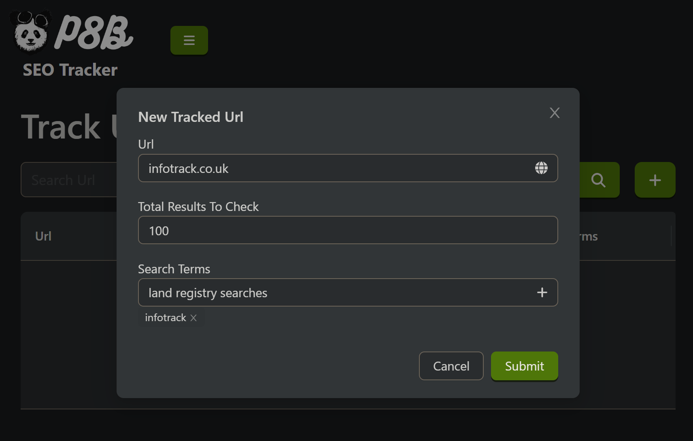
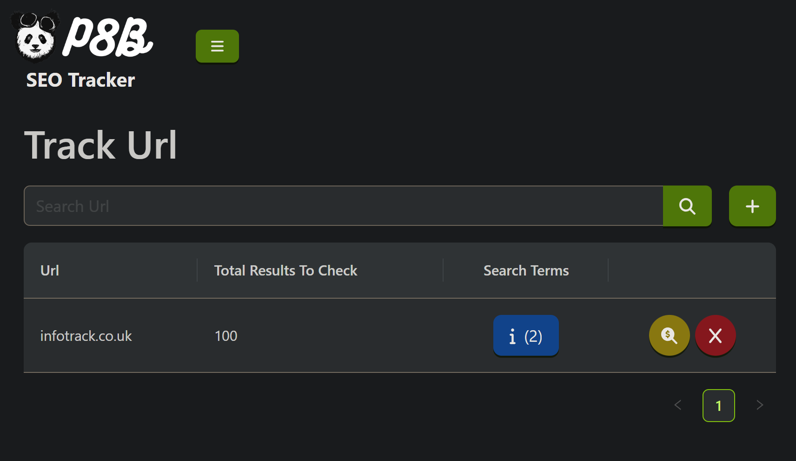
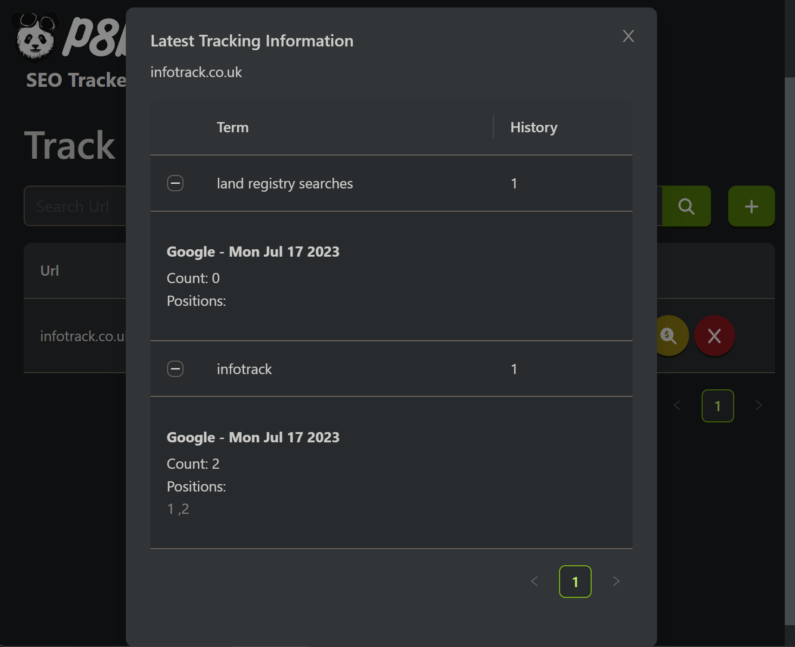

# SEO Tracker

 The primary goal of this project is to monitor search rankings for specified URLs and keywords. It is based on clean architecture principles, featuring the following distinct layers:

- **Domain** layer contains the core interfaces, enums and entities of the domain.
- **Application** layer consists of the business logic and application DTOs.
- **Infrastructure** layer implements the services required by the application layer.
- **Presentation** layer houses the consuming applications of the solution.

## Key Features:

* Add multiple URLs with associated search terms to track their rankings.
* Extract rankings from search engine results (currently supports Google searches).
* Easily expandable to integrate other search engines in the future.
* Back-end powered by .NET 7 API, providing robust performance.
* Entity framework core and SQL Express is used for data access and storage.
* Modern React 18 frontend with AndDesign component library for an engaging user interface.
* Simplified API calls with Swagger-generated DTOs and classes.
* Frontend development streamlined with Webpack, SCSS, and TypeScript.

# Getting started

1. After cloning the project navigate to ```.../Panda.SEOTracker/Presentation/Panda.SEOTracker.API``` directory and run the following command to apply the database migration.
   
   ```powershell
   dotnet ef database update --project "../../Infrastructure/Panda.SEOTracker.DataAccess"; dotnet run
   ```
3. Now open a new terminal and navigate to ```.../Panda.SEOTracker/Presentation/Panda.SEOTracker.WebUI``` and run the following command to install the web app packages and run it.

   ```powershell
   npm i; npm run start
   ```

# Screenshots

## Add a new tracked url.



## Tracked Url Table



## Tracking information




